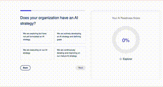

# CPR Test

This is the base repo for the CPR coding test.

This is designed to be a simple test of your coding ability. Since most of our clients use React, it is required here.

Upon getting access to this repo, you'll have **48hrs**  to complete the assignment. 

## The Task

### The Prerequisites

You are being given a bare repository with a simple React app. We have not added any dependencies to it, that will be up to you. 

We want to see you use at least one of the following:

- A State Management library (e.g. Redux, Zustand, StateX, etc.)
- TailwindCSS OR Sass **(DON'T use component libraries like MaterialUI or similar)** 

*Other libraries are allowed, but the above is required. * 

We recommend using a library for animations, but it's not required.

### The Requirements

This is a really close representation of what you'll be doing at CPR. Upon this [Figma link](https://www.figma.com/design/fe6dfe0cJ9PlomMQSkhOHN/Boomi-AI-Readiness-Assessment?node-id=0-1) you'll find a design for a simple app. 

We hope that you implement all the elements in the design.

Here is an example of what the final product could look like:

 

[Demo Video Link](./input.mov) 
*If this video does not play for you, you can watch the screen recording named `input.mov` on this repo* 

**ATTENTION** : we don't need you to create the D3 graph in the design.
But we understand that people have busy lives and we don't want to take too much of your time.

You also don't need to implement the animation of the numbers changing. 

#### Required Animations

We want the design to be as close as possible to the original (pixel perfect is required).

Required animations/transitions:
- The progress bar should animate as you progress through the questions.
- The buttons should have a hover effect.
- The questions should animate in and out.
- The buttons should adjust to the height of the question, that should be a smooth transition. 

You are NOT required to implement the animations of the numbers changing OR the D3 graph of the example. 

The APP DOES NOT need to be responsive.

### How you are gonna be scored

- **Code Quality**: We want to see clean, well-structured code.
- **Design Accuracy**: We want the design to be as close as possible to the original.
- **Animations**: We want to see smooth animations and transitions.
- **State Management**: We want to see you using a state management library.
- **CSS**: We want to see you using TailwindCSS or Sass.
- **Performance**: We want to see a performant app.
- **Libraries**: We want to see you using libraries that make sense for the project.

## How to submit

You should clone this repo and send us the link to your clone when you are done. 

## Next Steps:

- If you should do a good job, we will contact you to schedule a technical interview. 
- This will not be a whiteboard interview, but a conversation about your code and the decisions you made.
- You will be asked to explain your code and the reasoning behind your decisions.
- We may also ask you to make some changes to the code, so be prepared to do some live coding.

## Good Luck!

